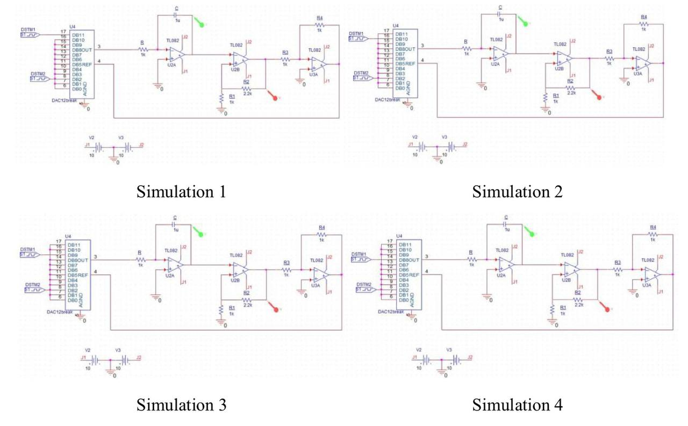
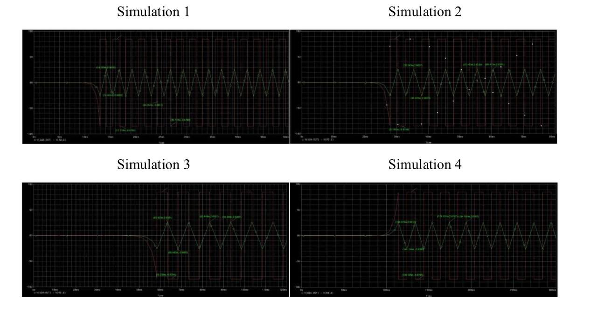
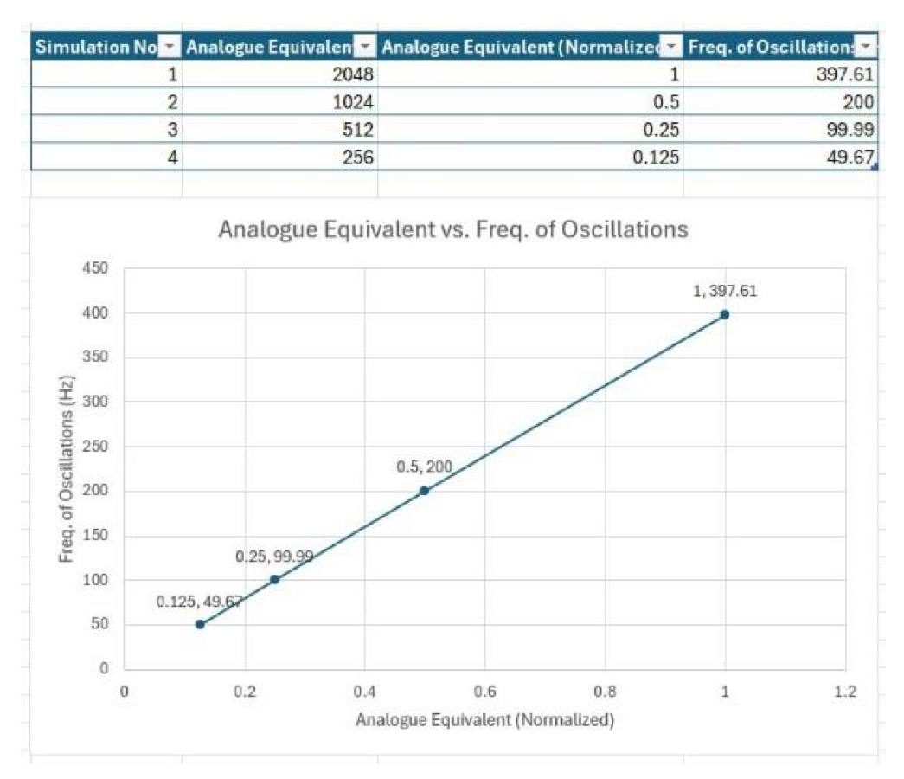

# Digitally Programmable Square and Triangular Wave Oscillator

**CV priority:** 02  
**Date:** April 2026  
**Type:** Mixed-Signal Systems Laboratory project  
**Tools:** PSpice, DAC7821/`DAC12break`, TL082 op-amps  
**Source report:** `Mixed Signal System Lab Report Group 9.pdf`

## Project Summary

This project designed a digitally controlled oscillator that generates square and triangular waveforms. Instead of setting the oscillator frequency only through fixed resistors and capacitors, the circuit uses a 12-bit multiplying DAC to make the frequency programmable through a digital input word.

The oscillator is based on an integrator-comparator architecture. The MDAC controls the effective current into the integrator, so changing the digital code changes the capacitor charging rate and therefore the oscillation frequency.

## Circuit Architecture

Three cascaded TL082 op-amp stages are driven by the DAC12break MDAC:

- **U4 — DAC12break MDAC:** Converts the 12-bit digital input word into a proportional output current. The reference voltage is fed from the comparator output, making the DAC an active element within the oscillation loop.
- **U2A — Inverting Integrator:** The MDAC current is injected through a 1 kΩ resistor into the inverting input, with a 1 µF feedback capacitor producing a linearly ramping triangular wave. Ramp slope = I_out / C, directly proportional to the digital code.
- **U2B — Schmitt Trigger Comparator:** The triangular wave drives a hysteresis network (R1 = 1 kΩ, R2 = 2.2 kΩ), and the comparator switches between ±8.48 V saturation levels to produce the square wave output and close the oscillation loop.
- **U3A — Unity-Gain Buffer:** Isolates the comparator output from external loading without altering the waveform.

## PSpice Simulation Setup

Four simulations were run with four different 12-bit digital codes, each progressively halving the input value to halve the oscillation frequency.

## Frequency Derivation

The oscillation frequency follows directly from the integrator ramp rate and comparator switching threshold:

f = (D / 2^N) × f_max

With f_max = 400 Hz and the reference code D_FS = 2048, the four cases give:

| Simulation | Digital Code D | Calculated Frequency |
|---|---|---|
| 1 | 2048 | 400.00 Hz |
| 2 | 1024 | 200.00 Hz |
| 3 | 512  | 100.00 Hz |
| 4 | 256  | 50.00 Hz  |

## Simulation Results

Transient analysis confirmed stable square and triangular wave oscillation in all four cases. Simulation time was extended progressively (50 ms → 300 ms) to capture multiple complete cycles after the settling transient.

## Results Summary

| Simulation | Bit Pattern     | Vpk-pk Square (V) | Vpk-pk Triangle (V) | Calculated f (Hz) | Simulated f (Hz) | Discrepancy |
|---|---|---|---|---|---|---|
| 1 | 1000 0000 0000 | 16.9588 | 5.3238 | 400   | 397.61 | 0.60% |
| 2 | 0100 0000 0000 | 16.9588 | 5.3207 | 200   | 200.00 | 0%    |
| 3 | 0010 0000 0000 | 16.9588 | 5.2966 | 100   | 99.99  | 0.01% |
| 4 | 0001 0000 0000 | 16.9588 | 5.2800 | 50    | 49.67  | 0.66% |

The graph below confirms a clean linear relationship between the normalised digital input and oscillation frequency, as predicted by the transfer function.

All discrepancies are under 0.66%, consistent with finite op-amp gain-bandwidth effects in the TL082 (4 MHz GBW, 13 V/µs slew rate) and the behavioural approximation of the DAC12break model.

## Key Results

| Metric | Result |
|---|---|
| Frequency range | 50 Hz to 400 Hz |
| Control method | 12-bit digital input word through MDAC |
| Output waveforms | Square wave and triangular wave |
| Frequency accuracy | Under 0.66% discrepancy against theoretical model |
| Main non-ideality | Finite op-amp gain-bandwidth and DAC model resolution |

## What I Learned

- How an MDAC converts a digital control word into an analog timing current, enabling digital frequency control without changing passive components.
- Why the square wave amplitude remains constant across all codes (set by op-amp rail saturation), while the triangular amplitude shows small code-dependent variation from integrator non-idealities.
- How to derive a closed-form frequency expression from integrator ramp rate and comparator threshold, then validate it against simulation.
- How to identify sources of discrepancy between theoretical and simulated results in a mixed-signal system.

## Recruiter Notes

This project shows mixed-signal thinking: digital control, analog waveform generation, and validation against a derived model. It is relevant to signal generation, sensor interfaces, test equipment, and embedded analog front-end work.

## Next Improvements

- Confirm whether the design was physically implemented or simulation-only.
- Add oscilloscope measurements from a breadboard build for direct simulation-vs-hardware comparison.
- Extend the digital code sweep to verify linearity across more points.
