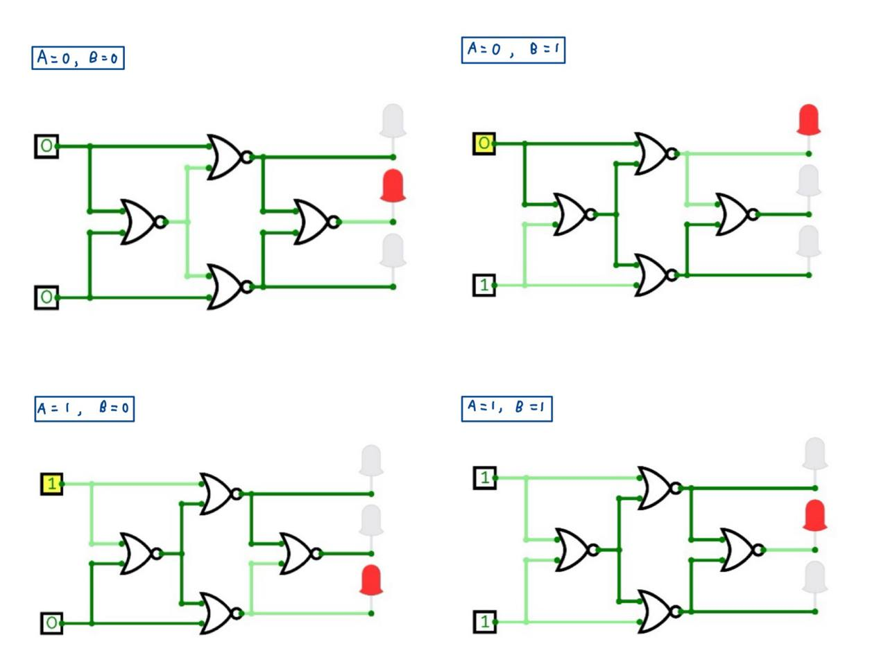
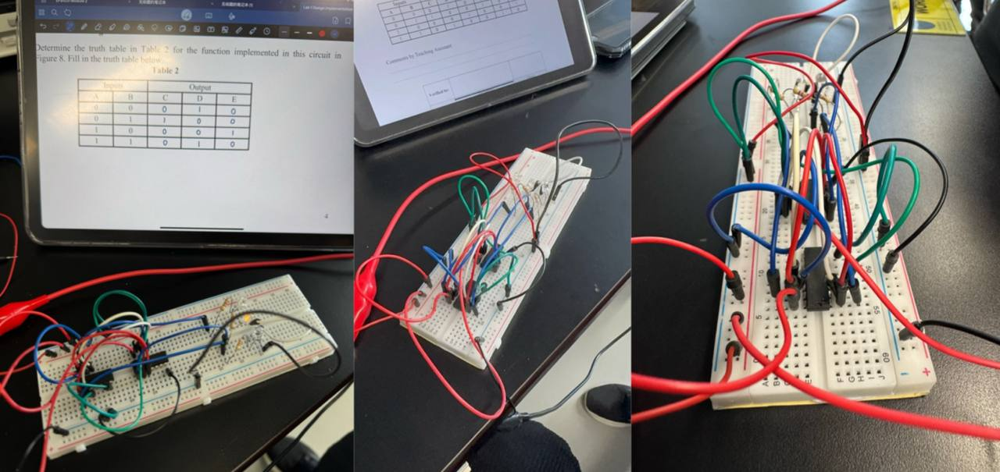
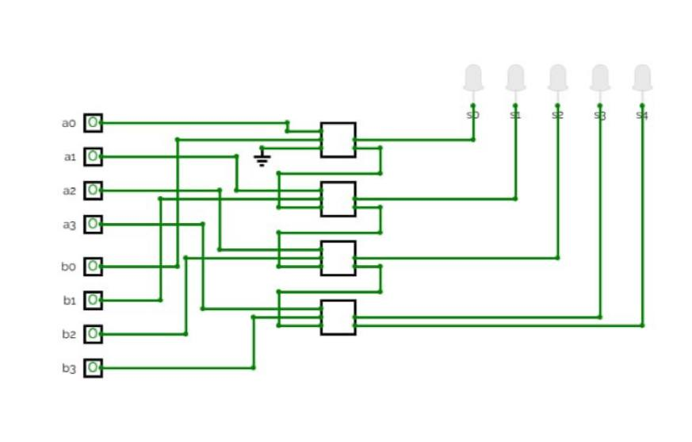
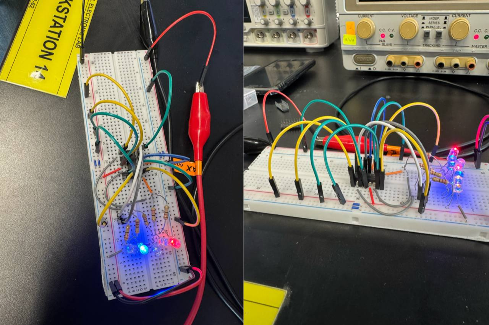
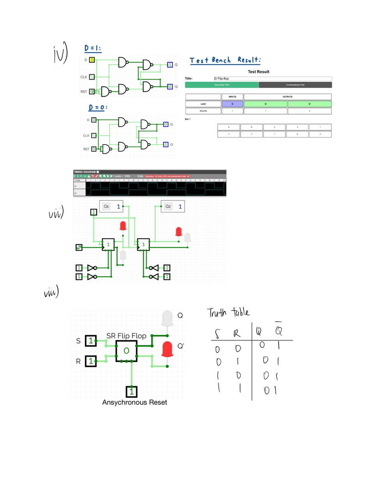
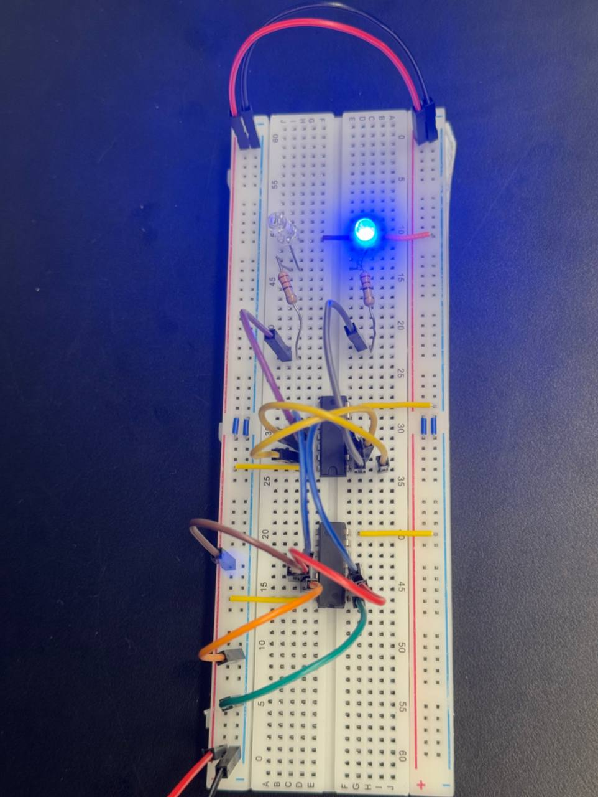

# Digital Logic Circuits: Sequential and Combinational System Design

**CV priority:** 03
**Date:** January–March 2025
**Type:** Digital Electronics Laboratory (EFB1054)
**Tools:** Breadboard, 74xx logic ICs, CircuitVerse, DMM
**Source reports:** Module 1, Module 2, Module 3 lab reports

## Project Summary

This three-module laboratory sequence covered the physical implementation of core digital
logic systems, progressing from Boolean minimization and universal-gate construction through
arithmetic logic to sequential memory elements. Each module moved from theory to
breadboard build, with CircuitVerse simulation used for pre-lab verification before hardware
implementation.

## Module 1 — K-Map Minimization and Universal Gate Implementation

**Date:** 23 January 2025 | **ICs used:** 7400 (NAND), 7402 (NOR), 7404 (Inverter), 7408 (AND)

A two-input logic circuit was analysed, its truth table derived, and the Boolean expressions
for outputs C, D, and E simplified using Karnaugh maps. The minimized expressions were
then implemented using the minimum number of NAND/NOR universal gates and verified
against the theoretical truth table.

Minimized expressions:
C = Ā·B
E = A·B̄
D = C̄ + Ē  =  Ā·B̄ + A·B  (XNOR function)

The circuit was first verified in CircuitVerse across all four input combinations before
breadboard construction.

**Breadboard implementation — outputs C, D, E via LED indicators:**

**Verified results (theory vs experiment match):**

| A | B | C (theory) | D (theory) | E (theory) | C (expt) | D (expt) | E (expt) |
|---|---|---|---|---|---|---|---|
| 0 | 0 | 0 | 1 | 0 | 0 | 1 | 0 |
| 0 | 1 | 1 | 0 | 0 | 1 | 0 | 0 |
| 1 | 0 | 0 | 0 | 1 | 0 | 0 | 1 |
| 1 | 1 | 0 | 1 | 0 | 0 | 1 | 0 |

TA comment: *Successfully Completed* — verified 23/1/2025.

---

## Module 2 — 4-Bit Parallel Adder and Subtractor

**Date:** 20 February 2025 | **ICs used:** SN7483 (4-bit adder), SN7486 (XOR), 9× LEDs, 10 kΩ resistors

A 4-bit parallel adder was designed using four cascaded full adders inside the SN7483 IC.
The SN7486 XOR gates were added to implement 2's complement subtraction by inverting the
B inputs under carry-in control.

Sum equation:    Σᵢ = Aᵢ ⊕ Bᵢ ⊕ Cᵢₙ
Carry equation:  Cₒᵤₜ = AᵢBᵢ + Cᵢₙ(Aᵢ ⊕ Bᵢ)

The circuit was verified in CircuitVerse before breadboard construction, with LED outputs
at each sum bit and carry-out confirming correct binary addition.

**Selected verified results (Cᵢₙ = 0):**

| Cᵢₙ | A    | B    | Expected Sum | Cₒᵤₜ | Measured Sum | Cₒᵤₜ |
|-----|------|------|-------------|-------|-------------|-------|
| 0   | 0001 | 0101 | 0110        | 0     | 0110        | 0     |
| 0   | 1001 | 0001 | 1010        | 0     | 1010        | 0     |
| 0   | 1111 | 1111 | 1110        | 1     | 1110        | 1     |
| 1   | 1001 | 0000 | 1010        | 0     | 1010        | 0     |
| 1   | 1111 | 1111 | 1111        | 1     | 1111        | 1     |

TA comment: *Successfully Completed* — verified 20/2/2025.

---

## Module 3 — Flip-Flops and Latches

**Date:** 5 March 2025 | **ICs used:** 7408 (AND), 7402 (NOR)

An active-HIGH SR latch was implemented using 7408 AND gates and 7402 NOR gates on a
breadboard. The Enable signal was used to gate S and R inputs, demonstrating clocked latch
behavior and the invalid state condition. A D flip-flop was also designed and simulated in
CircuitVerse with a synchronous reset testbench.

**D flip-flop CircuitVerse simulation with testbench verification:**

**SR latch breadboard — Q output LED confirmed correct set/reset behavior:**

**SR latch with enable — verified truth table:**

| E | S | R | Q     | Q'    |
|---|---|---|-------|-------|
| 0 | × | × | latch | latch |
| 1 | 0 | 1 | 0     | 1     |
| 1 | 1 | 0 | 1     | 0     |
| 1 | 1 | 1 | 0     | 0     |

TA comment: *Completed — Managed to set experiment output correctly* — verified 6/3/2025.

---

## Key Concepts Practiced

| Module | Concept | ICs Used |
|---|---|---|
| 1 — K-map and gates | Boolean minimization, universal NAND/NOR implementation | 7400, 7402, 7404, 7408 |
| 2 — Adder/subtractor | Full adder, carry propagation, 2's complement subtraction | SN7483, SN7486 |
| 3 — Memory elements | SR latch, gated SR, D flip-flop, JK flip-flop | 7408, 7402 |

## What I Learned

- How K-map minimization reduces gate count before committing to hardware, avoiding
  unnecessary IC slots on the breadboard.
- Why the SN7483 carry chain means bit-1 addition cannot be read until carry has
  propagated through all four stages — real ripple carry delay observable in hardware.
- How the SR invalid state (S=1, R=1) manifests as Q=Q'=0 rather than the theoretical
  undefined, due to NOR gate switching time asymmetry in the 7402.
- How an Enable gate converts a latch into a clocked storage element, and why this is the
  structural foundation of the D flip-flop.

## Recruiter Notes

This project documents the physical implementation of digital logic fundamentals before
moving to Verilog RTL design. The breadboard-level experience with 74xx ICs — adders,
flip-flops, latches — directly supports the credibility of the HDL design work in Project 04,
because the same logic structures were first built and debugged in hardware.

## Next Improvements

- Add a brief comparison between the CircuitVerse waveform and expected timing diagram
  for the JK flip-flop (Module 3 pre-lab item vi).
- Note the specific wiring mistake encountered in Module 2 and how it was diagnosed
  through LED state inspection.

  
