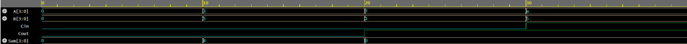
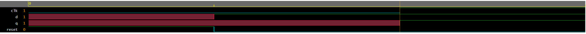
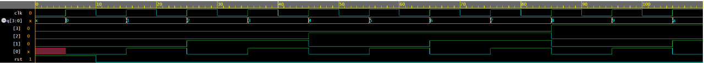

# Self-Directed FPGA and Verilog Design

**CV priority:** 04
**Date:** January 2025
**Type:** Self-directed digital design learning
**Tools:** Verilog HDL, EDA Playground simulation
**Source evidence:** CV details and EDA Playground simulations

## Project Summary

This self-directed project transferred digital-logic knowledge from breadboard circuits into
RTL design. Working outside of coursework, the goal was to learn synthesizable Verilog,
write testbenches, and verify correct waveform behavior in simulation — building the
foundation for FPGA-based design work.

Three modules were implemented and verified: a combinational adder, a D flip-flop with
synchronous reset, and a 4-bit synchronous counter.

## Implemented Designs

### 4-Bit Combinational Adder

A combinational module that adds two 4-bit inputs and produces a 4-bit sum with carry-out.
Practiced module port declarations, combinational `assign` statements, and verifying
arithmetic behavior across input combinations in a testbench.

**Simulation:** [EDA Playground — 4-bit adder](https://www.edaplayground.com/x/D9sH)

---

### D Flip-Flop with Synchronous Reset

An edge-triggered D flip-flop that captures the input on the rising clock edge and resets Q
to zero synchronously when reset is asserted. Practiced non-blocking assignments (`<=`) and
verified setup/hold and reset behavior in simulation.

**Simulation:** [EDA Playground — D flip-flop](https://www.edaplayground.com/x/btdw)

---

### 4-Bit Synchronous Counter

A clocked counter that increments on every rising edge and resets to zero when the reset
signal is asserted. Practiced `always @(posedge clk)` blocks, state transition logic, and
verified the full 0–15 count sequence and reset behavior in simulation.

**Simulation:** [EDA Playground — 4-bit counter](https://www.edaplayground.com/x/B3qB)

---

## Key Concepts Practiced

| Design | Concept |
|---|---|
| 4-bit combinational adder | Combinational logic, module I/O, `assign` |
| D flip-flop with synchronous reset | Edge-triggered sequential logic, non-blocking assignments |
| 4-bit synchronous counter | State transitions, clocked updates, reset behavior |
| Testbenches (all three) | Functional verification, waveform interpretation |

## What I Learned

- How HDL differs from software programming: code describes hardware structure and
  timing, not sequential execution.
- Why non-blocking assignments (`<=`) are essential for clocked sequential logic to avoid
  race conditions.
- How to write a self-checking testbench and read simulation waveforms to confirm correct
  module behavior.
- How breadboard-level digital logic — counters, flip-flops, adders built from 74xx ICs —
  maps directly into FPGA-style RTL thinking.

## Recruiter Notes

This project demonstrates initiative beyond assigned coursework. The EDA Playground links
allow the simulation to be run and inspected directly. Relevant to digital IC design,
RTL verification, embedded systems, and FPGA prototyping roles.

## Next Improvements

- Upload Verilog source and testbench files into the repo under a `verilog/` subfolder.
- Extend to an FSM (finite state machine) design — UART transmitter or traffic light
  controller — as the next complexity step.
- Target Vivado or Quartus for synthesis and timing report generation.
