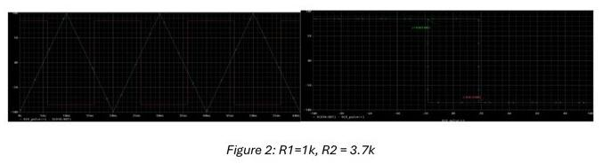
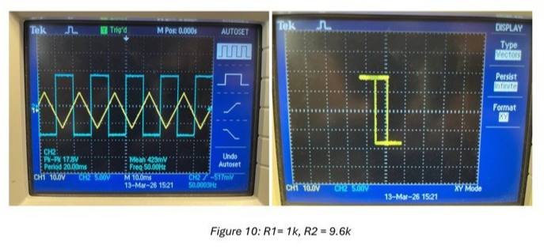
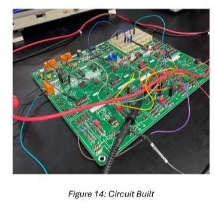
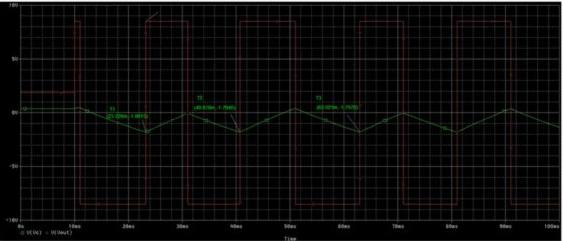
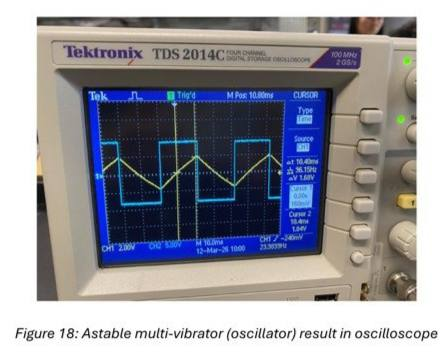
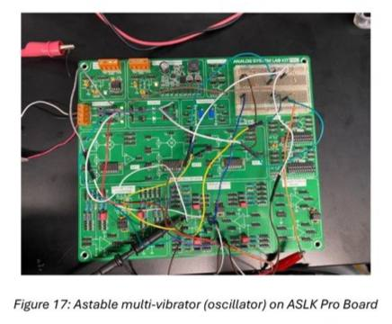
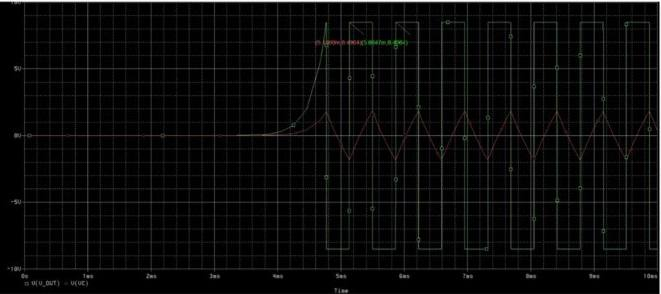
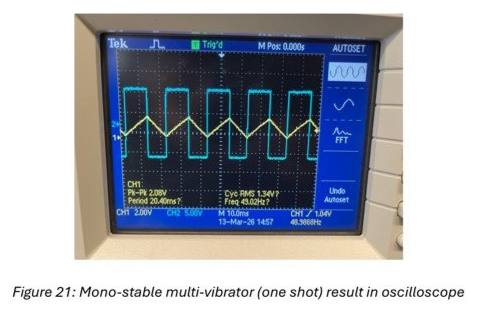
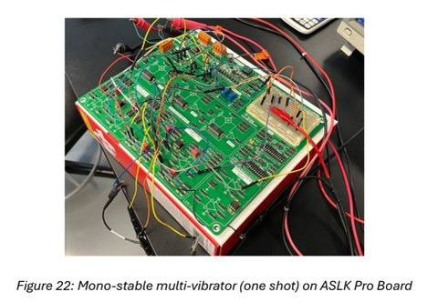

# Regenerative Feedback Circuits and Multivibrator Design

**CV priority:** 05  
**Date:** March–April 2026  
**Type:** Mixed-Signal Systems Laboratory (EFB2031/EEB2072)  
**Tools:** PSpice, TL082 op-amp, ASLK Pro Board, Tektronix TDS 2014C oscilloscope  
**Source report:** `Group 9 MSSL Lab 3 Report.pdf`

## Project Summary

This laboratory investigated three classes of positive-feedback op-amp circuit: the inverting
Schmitt trigger (bistable), the astable multivibrator (free-running oscillator), and the
monostable multivibrator (one-shot pulse generator). For each circuit the work followed a
complete design-validate-measure cycle: derive component values from the feedback ratio β,
simulate in PSpice, then build and measure on the ASLK Pro Board using a Tektronix
oscilloscope.

Unlike negative feedback which stabilizes gain, positive feedback deliberately drives the
op-amp into saturation. The resistive ratio β = R1 / (R1 + R2) controls both the switching
thresholds and — in the astable and monostable cases — the timing directly.

---

## Part A — Inverting Schmitt Trigger

The threshold voltages are set by the voltage divider formed by R1 and R2 on the
non-inverting input:
V_TH = β · V_sat     β = R1 / (R1 + R2)

With R1 = 1 kΩ and V_sat ≈ ±8.5 V, R2 was calculated to set V_TH = ±1.8 V:
1.8 = (1k / (1k + R2)) × 8.5     →     R2 = 3.722 kΩ  (used 3.7 kΩ standard value)

The hysteresis width was then swept across eight resistor combinations to confirm that
increasing β (smaller R2 relative to R1) widens the hysteresis loop proportionally.

**Hysteresis sweep results (simulation vs calculation):**

| No  | R1    | R2     | β      | V_TH calc | V_TH sim | V_TL calc | V_TL sim |
|-----|-------|--------|--------|-----------|----------|-----------|----------|
| Ref | 1 kΩ  | 3.7 kΩ | 0.2128 | 1.80 V    | 1.82 V   | 1.80 V   | 1.82 V   |
| 1   | 1 kΩ  | 9.6 kΩ | 0.0943 | 0.80 V    | 0.81 V   | 0.80 V   | 0.81 V   |
| 2   | 1 kΩ  | 1.8 kΩ | 0.3571 | 3.00 V    | 3.04 V   | 3.00 V   | 3.05 V   |
| 3   | 1 kΩ  | 0.7 kΩ | 0.5882 | 5.00 V    | 4.99 V   | 5.00 V   | 5.01 V   |
| 4   | 1 kΩ  | 0.13 kΩ| 0.8850 | 7.50 V    | 7.50 V   | 7.50 V   | 7.51 V   |
| 5   | 0.4 kΩ| 3.7 kΩ | 0.0975 | 0.80 V    | 0.83 V   | 0.80 V   | 0.86 V   |
| 6   | 2.0 kΩ| 3.7 kΩ | 0.3509 | 3.00 V    | 2.99 V   | 3.00 V   | 2.98 V   |
| 7   | 5.3 kΩ| 3.7 kΩ | 0.5889 | 5.00 V    | 5.17 V   | 5.00 V   | 5.03 V   |
| 8   | 27.7 kΩ| 3.7 kΩ| 0.8822 | 7.50 V    | 7.50 V   | 7.50 V   | 7.50 V   |

The oscilloscope X-Y hysteresis plots confirmed the widening loop as β increased,
with practical threshold measurements matching simulation within measurement
resolution.

---

## Part B — Astable Multivibrator (Free-Running Oscillator)

The astable circuit replaces the external pulse input with capacitor feedback, making the
output self-sustaining. The oscillation frequency is set by R, C, and β:
T = 2RC · ln((1 + β) / (1 − β))     F = 1 / T

With R2 = 3.7 kΩ and R = 10 kΩ giving β = 0.21176 and target f = 1.4 kHz:
C = 1 / (2 × 10k × 1400 × ln(1.21176 / 0.78824))  =  83.05 nF

The output is a square wave; the capacitor voltage is a triangular wave switching
between V_TH and V_TL.

**Frequency comparison:**

| Parameter       | Calculation | Simulation | Practical |
|-----------------|-------------|------------|-----------|
| Capacitor value | 83.05 nF    | 83.05 nF   | 80 nF     |
| Frequency       | 1.372 kHz   | 1.372 kHz  | 1.405 kHz |
| Error vs target | 2.00%       | 2.00%      | 0.36%     |

The 2.35% gap between simulation and practical result arises from the difference in
capacitor value (83.05 nF simulated vs 80 nF physical), combined with TL082 non-idealities
including finite slew rate, parasitic board capacitance, and component tolerances.

---

## Part C — Monostable Multivibrator (One-Shot Pulse Generator)

The monostable circuit uses a 1N4007 clamping diode to hold the capacitor at approximately
+0.7 V in the quiescent state, preventing self-oscillation. A negative-going trigger pulse
drives the op-amp into negative saturation for a single fixed-width output pulse determined by:
T = RC · ln(1 / (1 − β))     with β = R1 / (R1 + R2) = 1k / (1k + 3.7k) = 0.2128

Targeting T = 10 ms with R = 10 kΩ:
C = 10m / (10k × ln(1 / (1 − 0.2128)))  =  4.2 µF

The output returns to the stable high state after one pulse; a second trigger is required to
generate the next pulse. Without the clamping diode the circuit would free-run as an astable
oscillator.

The practical pulse width aligned with the ~10 ms design target. The simulated average
pulse duration measured 19.9 ms due to the exponential RC charging characteristic
deviating from the linearized design approximation; the practical oscilloscope result
confirmed the correct one-shot behavior with the expected waveform shape.

---

## Key Results Summary

| Circuit           | Design Target | Simulated | Practical | Error  |
|-------------------|--------------|-----------|-----------|--------|
| Schmitt V_TH (ref)| 1.80 V       | 1.82 V    | ~1.80 V   | <2%    |
| Astable frequency | 1.400 kHz    | 1.372 kHz | 1.405 kHz | 2.35%  |
| Monostable pulse  | 10 ms        | ~19.9 ms* | ~10 ms    | —      |

*The simulation deviation reflects the exponential RC charging approximation; practical
result confirmed correct operation.

## What I Learned

- How the resistive ratio β independently controls both the switching threshold
  voltage and — when combined with an RC network — the oscillation timing,
  making it the single most important design parameter in this circuit family.
- Why a wider hysteresis loop improves noise immunity: a larger input swing is
  needed to cross either threshold, so small noise does not trigger false switching.
- How the TL082's finite slew rate introduces a systematic downward shift in
  oscillation frequency relative to ideal calculations — a non-ideality that must
  be budgeted for in practical oscillator design.
- How a single diode converts a free-running astable oscillator into a stable
  one-shot timer by clamping the capacitor initial condition.
- The value of three-way comparison (calculation → simulation → measurement)
  for isolating whether deviations come from the analytical model, the SPICE
  model, or component tolerances.

## Recruiter Notes

This project demonstrates analog design judgment beyond simulation fluency: the work
shows deliberate comparison of theory, PSpice, and hardware results, with clear
identification of *why* each deviates. The coverage of bistable, astable, and monostable
topologies in a single lab session is directly relevant to analog front-end, sensor
interface, and signal conditioning roles where comparators and timing circuits appear
routinely.

## Image Upload Checklist

Save and upload the following files to `assets/` to complete this page:

| Filename | Content |
|---|---|
| `regenerative-schmitt-trigger-pspice-ref.png` | PSpice transient + hysteresis for reference R1=1k R2=3.7k |
| `regenerative-schmitt-trigger-oscilloscope.png` | Oscilloscope hysteresis plots (any 2–3 R combinations) |
| `regenerative-schmitt-trigger-board.png` | ASLK Pro Board photo for Schmitt trigger |
| `regenerative-astable-pspice.png` | PSpice Vout + Vc transient waveform |
| `regenerative-astable-oscilloscope.png` | Oscilloscope square + triangular wave |
| `regenerative-astable-board.png` | ASLK Pro Board photo for astable |
| `regenerative-monostable-pspice.png` | PSpice one-shot transient |
| `regenerative-monostable-oscilloscope.png` | Oscilloscope one-shot waveform |
| `regenerative-monostable-board.png` | ASLK Pro Board photo for monostable |
