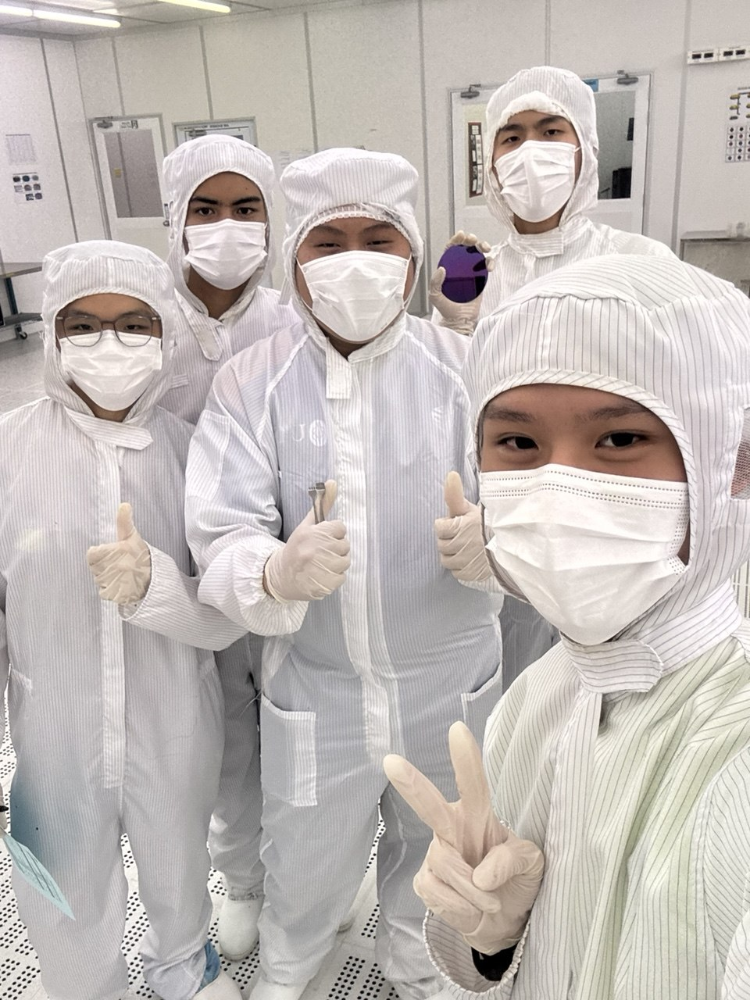
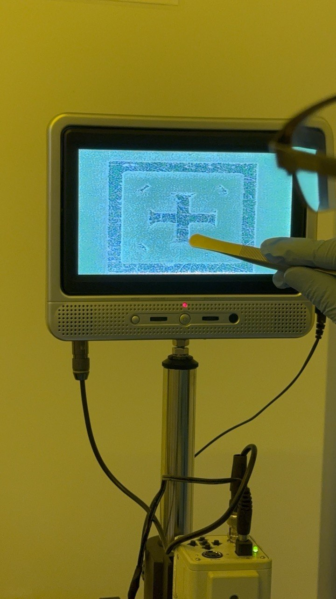
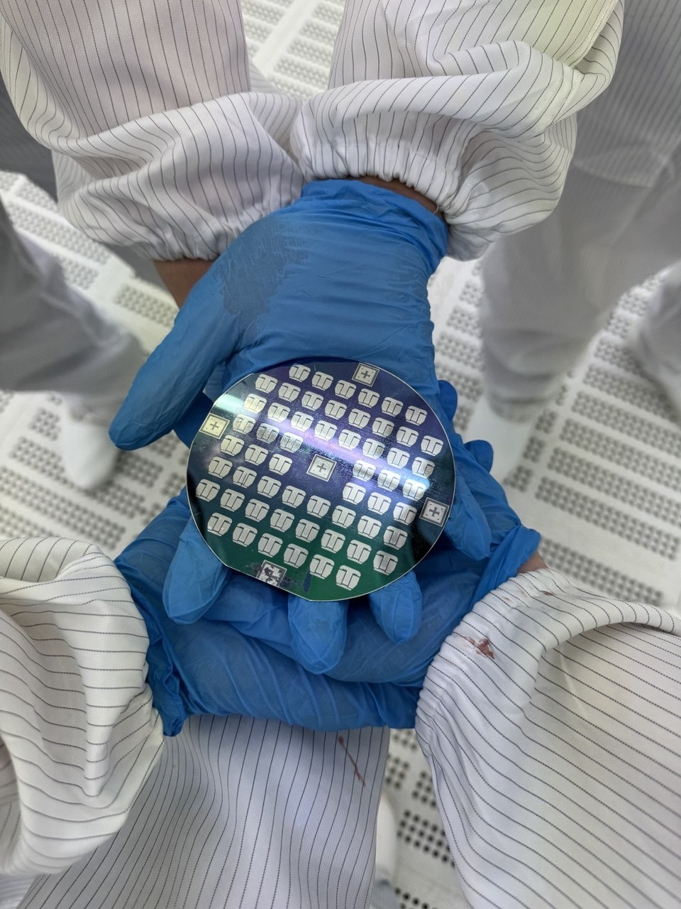
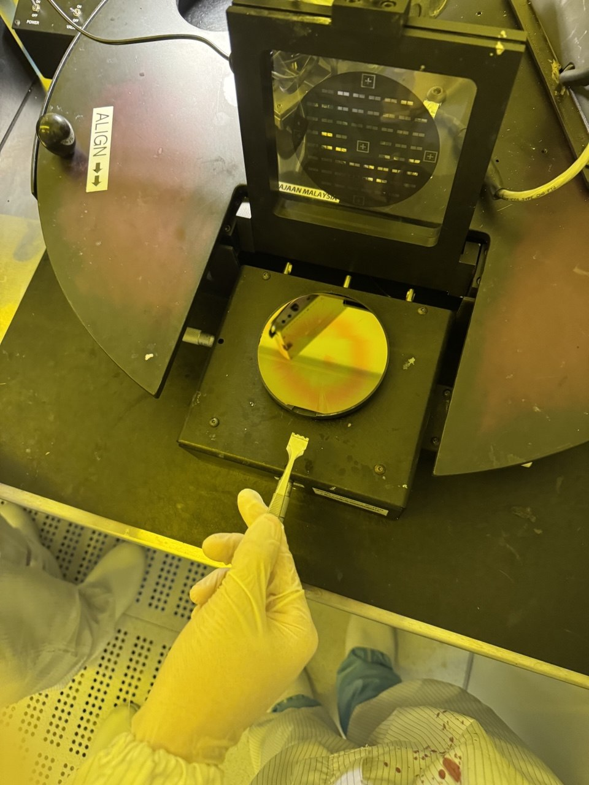
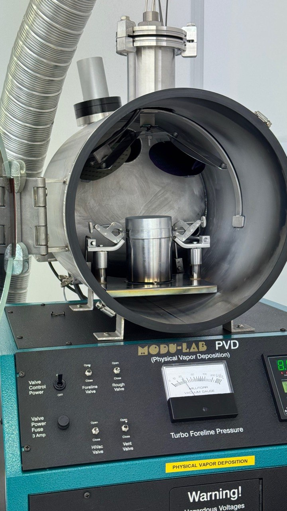
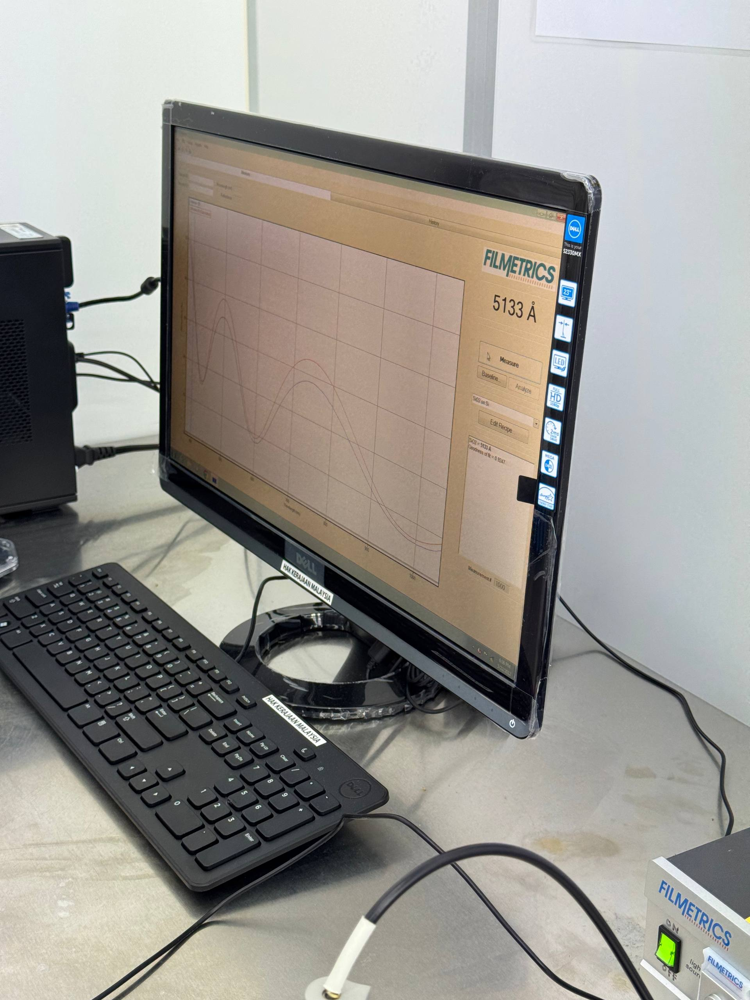
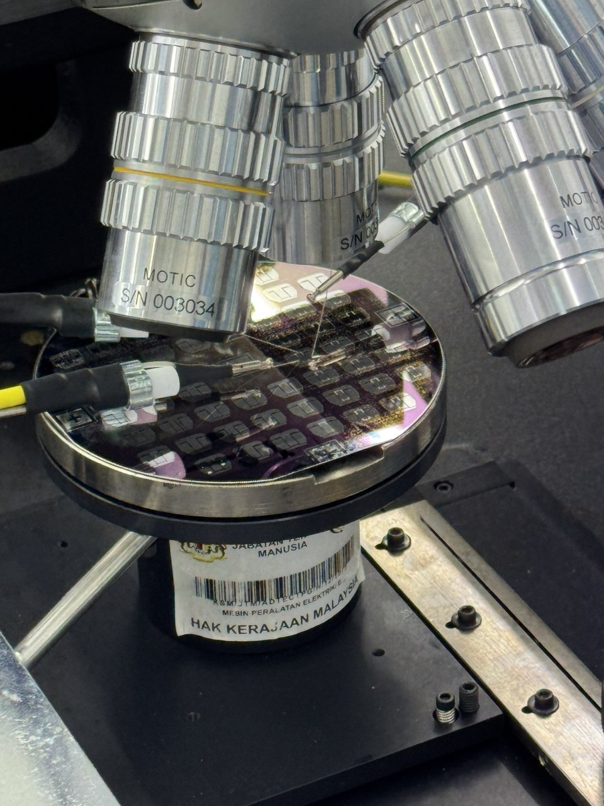
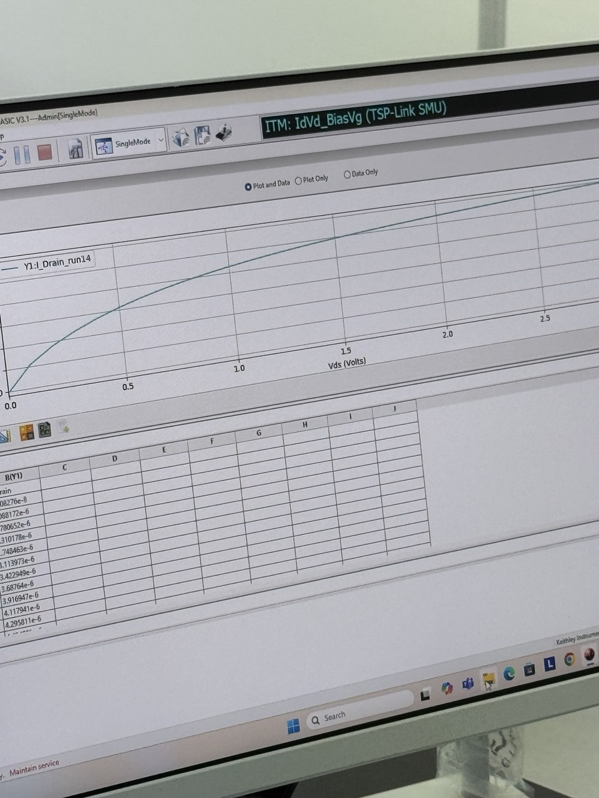

# NMOS Transistor Fabrication — Cleanroom Process

**CV priority:** 07  
**Date:** July 2025  
**Type:** Microelectronic Physics & Devices Laboratory — ADTEC Taiping  
**Tools:** Cleanroom process flow, profilometer, probe station, parametric analyzer  
**Source report:** `MPD LAB REPORT Session 1 Group 4.pdf`

## Project Summary

This project executed a complete NMOS transistor fabrication flow in a real semiconductor cleanroom at ADTEC Taiping, Perak. The work connected semiconductor device theory directly to physical process steps: thermal oxidation, UV photolithography, phosphorus diffusion, aluminum metallization, and electrical characterization. All steps followed an industry-style process run-card.

The fabricated devices were characterized electrically using a probe station and parametric analyzer, confirming NMOS transistor behavior consistent with theoretical I-V predictions.

## Cleanroom Environment

Fabrication was carried out under cleanroom protocols at ADTEC Taiping, including full gowning (bunny suit, hood, gloves, cleanroom footwear), air-shower entry, and strict contamination controls throughout the process.

## 4-Mask Process Flow

The NMOS was fabricated using a 4-mask process flow on a p-type silicon wafer (boron-doped, ~10¹⁵ to 10¹⁶ atoms/cm³):

| Step | Process | Key Parameters |
|---|---|---|
| 1 | Wafer cleaning | BOE + DI water, 15 s; spin dry, 30 s |
| 2 | Field oxide growth (wet oxidation) | 1050°C, N₂/O₂, 60 min |
| 3 | Mask 1 — Source/drain definition | Photoresist, UV 30 s, BOE etch 180 s |
| 4 | Phosphorus diffusion (n⁺ S/D) | 800°C, O₂/N₂, 15 min, spin-on dopant |
| 5 | Mask 2 — Gate region definition | Photoresist, UV 110 s, BOE etch 180 s |
| 6 | Gate oxide growth (dry oxidation) | 1000°C, N₂/O₂, 90 min |
| 7 | Mask 3 — Contact region patterning | Photoresist, UV 30 s, BOE etch 180 s |
| 8 | Aluminum metallization (PVD) | Al foil 4 cm × 4 cm, thermal evaporation |
| 9 | Mask 4 — Metal patterning | Photoresist, UV 110 s, Al etchant |

### Mask Aligner

### Wafer After Source/Drain Photolithography (Mask 1)

### Patterned Wafer — Close-Up

### PVD Metallization Chamber

## Oxide Thickness Measurement

Oxide thickness was measured at five points across the wafer using a Filmetrics spectrophotometer before and after dry oxidation.

| Stage | Average Oxide Thickness |
|---|---|
| Before 1st photolithography (after wet oxidation) | 4844.6 Å |
| After dry oxidation (gate oxide) | 5178.4 Å |
| Thickness increase | +333.8 Å |

The increase confirms additional oxide growth during the gate oxidation step. Variation across the five measurement points reflects non-uniform oxidation furnace conditions and manual process variability.

## Electrical Characterization

The final wafer was tested using a probe station and parametric analyzer. Drain current (I_DS) was measured as a function of drain voltage (V_DS) across five dies.

### I-V Summary

| Die | Max I_DS at V_DS = 3 V |
|---|---|
| Result 1 | 8.73 µA |
| Result 2 | 6.00 µA |
| Result 3 | 7.11 µA |
| Result 4 | 6.67 µA |
| Result 5 | 4.63 µA |

All five devices showed the expected NMOS output characteristic: drain current rising steeply in the linear region and levelling off as the device entered saturation, consistent with channel pinch-off at high V_DS.

The spread in maximum drain current across dies (4.63–8.73 µA) is attributed to three sources of process variation: non-uniform particle contamination affecting oxide layer thickness, photoresist residue from incomplete development, and manual variability in spin coating, UV exposure time, and BOE etch duration.

## Key Results

| Metric | Result |
|---|---|
| Process | 4-mask NMOS, p-type Si substrate |
| Field oxide thickness | 4844.6 Å average (5-point measurement) |
| Gate oxide thickness | 5178.4 Å average after dry oxidation |
| Electrical behavior | NMOS I-V saturation characteristic confirmed |
| Die-to-die variation | 4.63–8.73 µA at V_DS = 3 V |
| Cleanroom facility | ADTEC Taiping, Perak |

## What I Learned

- How each individual process step — oxidation temperature, dopant drive-in time, exposure duration, etch time — directly affects the electrical characteristics of the final device.
- Why gate oxide quality is critical: any defect, contamination, or non-uniformity in the thin gate oxide propagates directly into threshold voltage variation and reliability.
- How to read probe station I-V data and connect measured behavior to physical device physics (linear region, saturation, pinch-off).
- How process variation in a student cleanroom manifests as die-to-die spread in measured drain current, and how to identify the root causes.

## Personal Contribution

Introduction and objectives sections were written by Adam Wong Cheng Jie. Hands-on cleanroom fabrication steps and probe station I-V characterization were performed as part of the group lab session.

## Recruiter Notes

This is the flagship semiconductor-process project in the portfolio. It demonstrates real cleanroom exposure — gowning, wet/dry oxidation, photolithography, diffusion, PVD metallization, and parametric measurement — rather than only classroom theory. It directly supports applications in semiconductor process engineering, device characterization, and wafer fabrication roles.

## Next Improvements

- Add a profilometer screenshot showing the step-height measurement used to verify etch depth.
- Add an overlay of all five I-V curves on a single plot to visualize die-to-die variation more clearly.
- Confirm gate oxide thickness target vs. achieved value against the run-card specification.
